# ÕpiEestis – kasutusjuhend

ÕpiEestis on õppematerjalide ja testide portaal. Kasutaja saab valida õppeaine, lugeda õppematerjale, teha teste, kommenteerida ning sisselogituna salvestada materjale oma õpiteele. Administraator saab õppematerjale, teste ja kommentaare hallata.

## 1. Avaleht

Avalehel kuvatakse kolm viimast õppematerjali ning õppeainete loend. Ülemisest menüüst saab avada kõik õppematerjalid, õppeained, registreerimise ja sisselogimise.

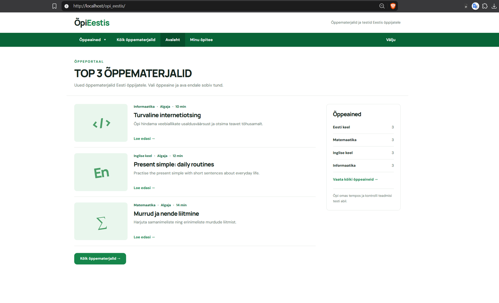

## 2. Õppeaine valimine

Menüüst **Õppeained** saab valida ühe neljast õppeainest: eesti keel, matemaatika, inglise keel või informaatika. Samad õppeained on saadaval ka eraldi õppeainete lehel.

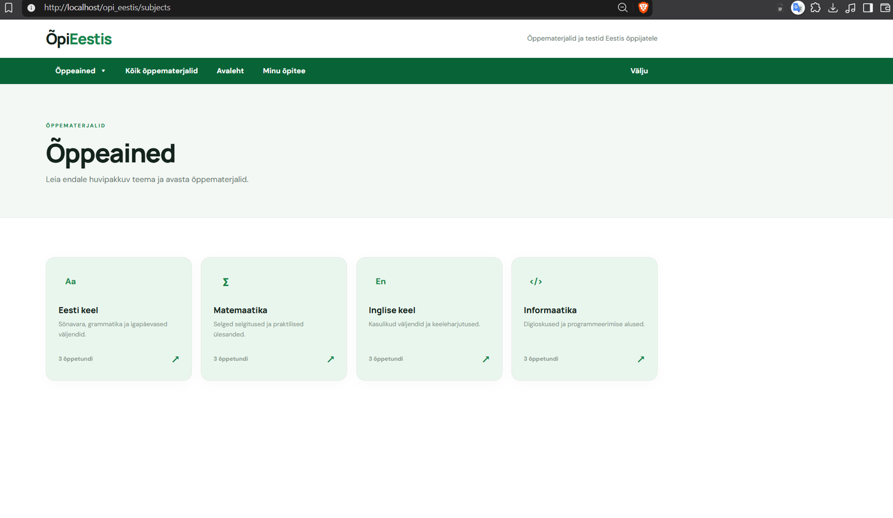

Õppeaine saab valida ka rippmenüüst.

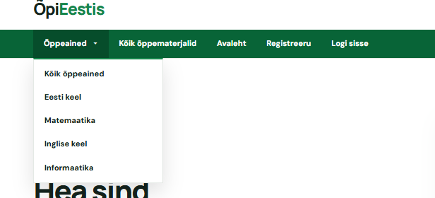

## 3. Kõik õppematerjalid, otsing ja filtrid

Lehel **Kõik õppematerjalid** kuvatakse kõik avaldatud õppetunnid. Materjale saab otsida märksõna järgi ning filtreerida õppeaine ja taseme järgi.

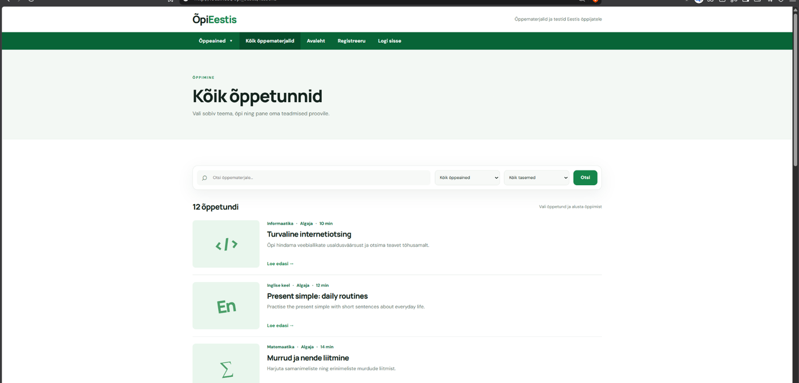

Näiteks saab valida ainult eesti keele materjalid.

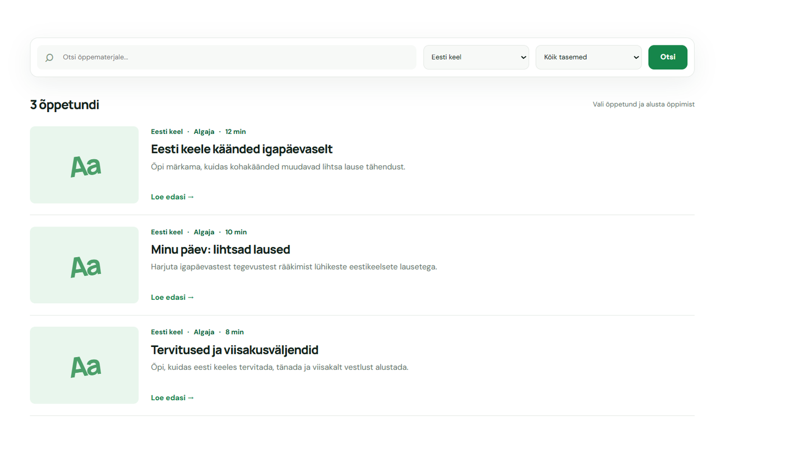

## 4. Õppetunni avamine

Nupu **Loe edasi** kaudu avaneb õppematerjali detailvaade. Lehel on õppetekst, õppeaine, raskusaste, kestus, test ning arutelu.

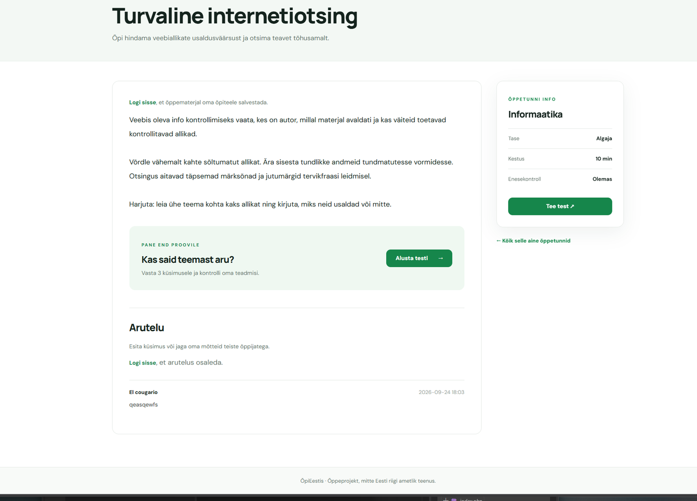

Sisselogitud kasutaja saab õppematerjali salvestada lehele **Minu õpitee**.

## 5. Testi tegemine

Kui õppematerjalile on lisatud test, saab vajutada **Alusta testi** või **Tee test**. Igal küsimusel on kolm vastusevarianti ja üks õige vastus.

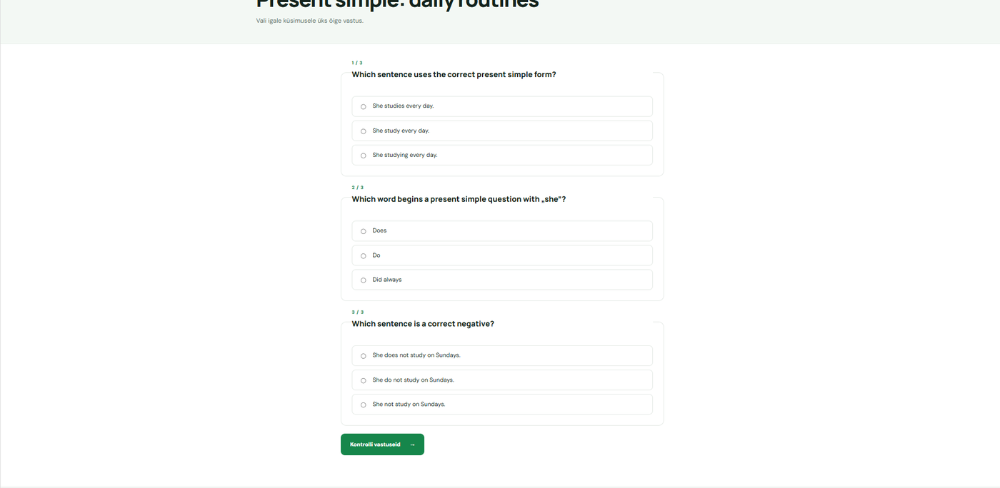

Pärast vastuste kontrollimist kuvatakse tulemus ja õiged vastused. Sisselogitud kasutaja testitulemus salvestatakse tema kontole.

## 6. Registreerimine

Uue konto loomiseks vali menüüst **Registreeru**. Sisesta kasutajanimi, e-posti aadress ning vähemalt 8 märgiga parool kaks korda. Uus kasutaja saab automaatselt rolli `user`.

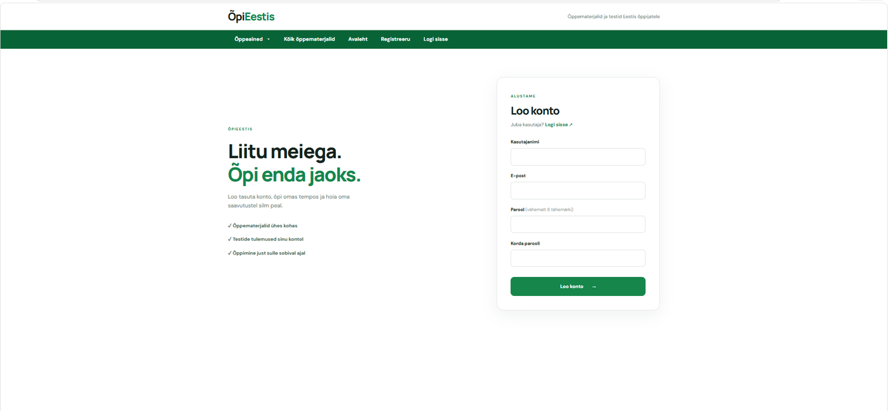

## 7. Sisselogimine

Vali menüüst **Logi sisse**, sisesta e-post ja parool ning vajuta **Logi sisse**.

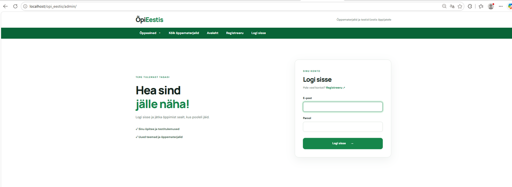

Pärast sisselogimist saab tavakasutaja kasutada lehte **Minu õpitee**. Administraatorile kuvatakse lisaks **Halduspaneel**.

## 8. Kommentaarid

Sisselogitud kasutaja saab iga õppematerjali all arutelus kommentaari lisada. Kommentaar kuvatakse koos kasutajanime ja lisamise ajaga.

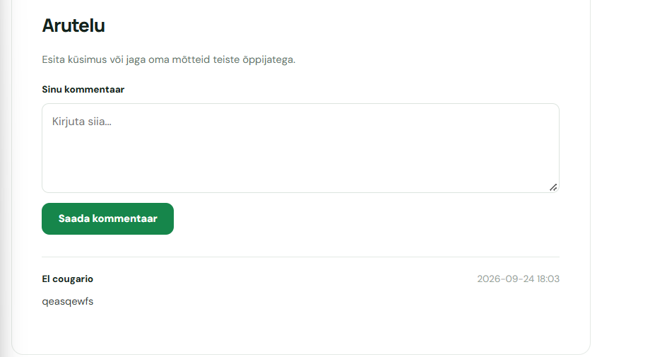

Administraator näeb kommentaari juures nuppu **Kustuta** ja saab sobimatu kommentaari eemaldada. Kustutamine on kaitstud administraatori rollikontrolli ja CSRF-tokeniga.

## 9. Minu õpitee

Sisselogitud kasutaja lehel **Minu õpitee** kuvatakse:

- salvestatud õppematerjalid;
- viimased testikatsed;
- läbitud testide tulemused;
- õppimise kokkuvõte.

Õppematerjali saab oma nimekirja lisada või sealt eemaldada õppetunni lehel oleva salvestamisnupu abil.

## 10. Administraatori haldus

Administraator logib sisse sama sisselogimisvormi kaudu. Administraatori kontol on ligipääs halduspaneelile.

Halduspaneelis saab:

1. lisada uue õppematerjali;
2. muuta olemasolevat õppematerjali;
3. kustutada õppematerjali;
4. määrata õppeaine, taseme ja kestuse;
5. lisada kaanepildi;
6. avaldada või peita õppematerjali;
7. lisada ja kustutada testiküsimusi;
8. kustutada kasutajate kommentaare.

Testiküsimuse lisamisel sisestatakse küsimus, kolm vastusevarianti ning märgitakse üks õige vastus.

## 11. Andmebaas

Projekt kasutab MySQL/MariaDB andmebaasi `opi_eestis`. Põhitabelid on `users`, `subjects`, `lessons`, `lesson_comments`, `lesson_bookmarks`, `quiz_questions`, `quiz_options` ja `quiz_attempts`.

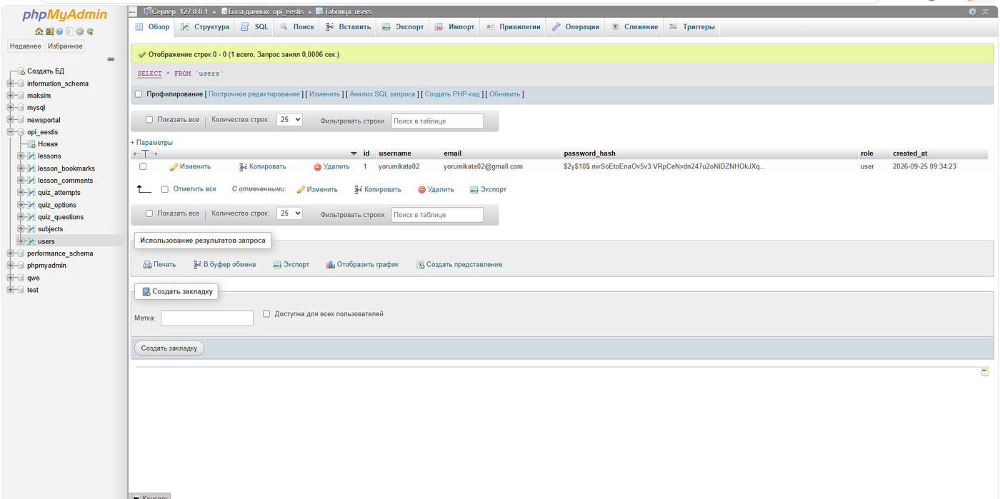

## 12. Väljalogimine

Sisselogitud kasutaja saab menüüst valida **Välju**. Pärast väljalogimist ei ole konto, salvestatud materjalide ega administraatori funktsioonid enam kättesaadavad enne uut sisselogimist.
